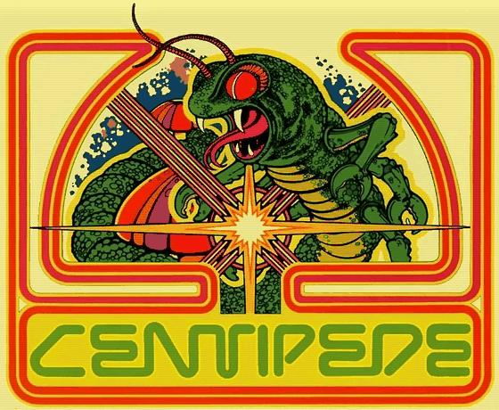
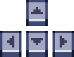

# Centipede (1981) – Modern p5.js Remake

<div align="center">
  
  <p><sub><em>Original Atari Centipede (1981) Arcade Sideart / Marquee Illustration with animated CRT scanlines & laser sweep effect. Sourced via <a href="https://www.reddit.com/r/1980s/comments/1oz3jdu/centipede_1981/">r/1980s</a> (original Atari archival art; poster is not claimed as author).</em></sub></p>
</div>

A faithful and modular recreation of the legendary 1981 Atari arcade classic **Centipede**, developed using JavaScript and the [p5.js](https://p5js.org/) creative coding library.

---

## 🕹️ Overview & Gameplay

### What is Centipede?
Originally released by Atari in 1981, **Centipede** is a seminal vertically oriented arcade shoot 'em up. Players command a bug blaster ship confined to the bottom quadrant of an enchanted mushroom forest. The primary threat is a multi-segmented centipede that winds its way down the screen, deflecting off mushrooms and splitting into autonomous sub-centipedes whenever an inner segment is shot.

Alongside the centipede, players contend with hazardous side-spiders, falling fleas that replenish the mushroom garden, and an evolving color palette with escalating difficulty as levels progress.

### Visual Showcase & Gameplay Previews
<!-- Placeholder media slots: Replace with screenshots or recorded gameplay GIFs -->
| Start Screen & Audio Welcome | Active Gameplay & Dynamic Field |
| :---: | :---: |
| <br><sub>*Introductory screen with welcome theme*</sub> | <br><sub>*Centipede splitting and mushroom clearing*</sub> |

| Flea & Spider Encounters | Game Over & Scoring HUD |
| :---: | :---: |
| <br><sub>*Flea dropping mushrooms and spider bouncing*</sub> | <br><sub>*Score display and state transition*</sub> |

> 💡 **Tip for presentation:** Adding a lightweight 5–10 second animated `.gif` of active gameplay in the table above dramatically boosts engagement and visually proves game mechanics to reviewers and recruiters.

---

## 🎮 How to Play

### Controls
| Input / Controls | Action |
| :---: | :--- |
| <br><sub>**Arrow Keys / Movement**</sub> | Move the player ship across the designated player boundary |
| <br><sub>**Spacebar**</sub> | Fire laser bullets upward |

### Core Mechanics
- **The Mushroom Garden:** Mushrooms take up to 4 hits to destroy. They act as barriers that redirect enemies.
- **The Centipede:** Moves horizontally across the grid and steps downward upon colliding with screen edges or mushrooms. Destroying any body segment instantly transforms the trailing segment into an independent new head!
- **The Flea:** Falls vertically when mushroom density drops, leaving new mushrooms in its wake.
- **The Spider:** Bounces erratically inside the player territory, eating mushrooms and providing high-risk target points.

---

## 👥 Team & Development Roles

The project was engineered with a modular, contract-based architecture where each developer took ownership of distinct systems:

| Developer | Role | Key Contributions |
| :--- | :--- | :--- |
| **Farid** | **Game Engine & UI** (*The Director*) | Authored [sketch.js](sketch.js). Orchestrated the central game loop (`setup` and `draw`), game state transitions (`MENU`, `PLAYING`, `GAMEOVER`), master collision resolution, palette swapping across stages, dynamic UI/HUD rendering, and audio playback hooks. |
| **Daniela** | **Environment & Grid** (*The Builder*) | Authored [GridManager.js](GridManager.js) and [Mushroom.js](Mushroom.js). Designed the grid coordinate system, procedural initial mushroom layout, multi-stage mushroom degradation (4 HP lifecycle with damage frames), and spatial query methods (`hasMushroomAt`). |
| **Ángel** | **Player Mechanics & Extra Enemy** (*The Gunner*) | Authored [Player.js](Player.js), [Bullet.js](Bullet.js), and the added **[Flea.js](Flea.js)**. Implemented player boundary enforcement within `PLAYER_AREA_Y`, firing rate cooldowns, projectile kinematics, and designed the **Flea**—an enemy not initially planned in early drafts that was integrated to accurately replicate the arcade mechanic of dropping mushrooms vertically. |
| **Nicolás** | **AI & Enemies** (*The Biologist*) | Authored [Centipede.js](Centipede.js), [CentipedeSegment.js](CentipedeSegment.js), and [Spider.js](Spider.js). Built the segmented pathfinding algorithms, head conversion upon mid-body destruction, edge and obstacle rebounding, and erratic multi-directional spider bouncing behaviors. |

---

## 📁 Project Architecture & Class Responsibilities

### Directory Structure
```text
Centipede_1981/
├── assets/
│   ├── Centipede1981_banner.gif # Animated arcade marquee with CRT & laser sweep effect
│   ├── controls_arrows.gif      # Animated movement controls showcase
│   ├── controls_space.gif       # Animated fire control showcase
│   ├── kb_light_symbols.png     # Controller & Keyboard Icons sprite sheet (by Vryell)
│   ├── Dead.wav           # Player elimination audio effect
│   ├── Shoot.wav          # Laser shot audio effect
│   ├── Spider.wav         # Ambient sound loop during spider encounters
│   ├── Track.wav          # Welcome track played on start screen
│   └── sprite.png         # Master arcade gameplay sprite sheet
├── lib/
│   ├── p5.js              # p5.js core graphics library
│   └── p5.sound.js        # p5.js Web Audio extension library
├── Bullet.js              # Projectile class
├── Centipede.js           # Multi-segment centipede controller
├── CentipedeSegment.js    # Single centipede unit logic & rendering
├── constants.js           # Grid dimensions, scale, colors & sprite coordinates
├── Explosion.js           # Particle explosion animations
├── Flea.js                # Flea enemy entity with vertical drops
├── GridManager.js         # Level initialization & spatial lookup
├── index.html             # Main entry point & canvas wrapper
├── Mushroom.js            # Mushroom health states & sprite rendering
├── Player.js              # Player movement & shooting controls
├── sketch.js              # Main application loop, UI & collision manager
└── Spider.js              # Erratic spider enemy logic
```

### Class Responsibilities Overview
- **[sketch.js](sketch.js):** Coordinates loading of assets, instantiates global entities, evaluates bounding-box collisions, switches level palettes, and renders the HUD.
- **[constants.js](constants.js):** Houses single-source-of-truth constants (`TILE_SIZE = 16`, `COLS = 30`, `ROWS = 40`, `PLAYER_AREA_Y`, sprite sub-rectangles, and color palettes).
- **[Player.js](Player.js):** Tracks ship coordinates, clamps positioning to the legal lower player area, handles keyboard input, and manages weapon cooldowns.
- **[Bullet.js](Bullet.js):** Handles linear upward movement, lifetime verification, and deactivation on collision.
- **[Mushroom.js](Mushroom.js):** Tracks 4 hit points, updates sprite frames according to wear, and notifies the engine when destroyed.
- **[GridManager.js](GridManager.js):** Spawns randomized mushrooms while leaving the player baseline clear, and provides `hasMushroomAt(col, row)` queries for enemy navigation.
- **[Centipede.js](Centipede.js) & [CentipedeSegment.js](CentipedeSegment.js):** Controls linked segment chains, detects obstacle bounces, steps downward, and handles mid-body splits into new independent heads.
- **[Spider.js](Spider.js):** Moves in zig-zag trajectories within the lower screen, eating mushrooms and threatening the ship.
- **[Flea.js](Flea.js):** Spawns at the top of the canvas, drops straight down at speed thresholds, and deposits mushrooms in empty tiles.
- **[Explosion.js](Explosion.js):** Renders short-lived frame-based visual bursts when enemies or obstacles are struck.

---

## 🎨 Sprites, Artwork & Visual Assets

### In-Game Gameplay Sprites
To recreate the authentic arcade feel, all visual gameplay assets were consolidated and sliced from the original arcade cabinet sprite sheet:
- **Arcade Gameplay Sprite Sheet:** [The Spriters Resource – Centipede (Arcade)](https://www.spriters-resource.com/arcade/centipede/asset/50437/)
- **Coordinate Analysis & Slicing:** Sprites were measured and mapped using [Photopea](https://www.photopea.com/). By overlaying custom pixel grids, the exact pixel sub-rectangles `(x, y, w, h)` for every rotation, animation frame, and entity were mapped into [constants.js](constants.js).
- **Dynamic Palette Swapping:** Using grid offsets, sprite slices update automatically based on `(currentLevel - 1) % PALETTE_OFFSETS.length`, replicating the cabinet's hardware palette swaps across waves.

<!-- Placeholder for Sprite Sheet & Photopea mapping demonstration -->

*<sub>Figure: Analyzing sprite sheet offsets and bounding boxes with Photopea.</sub>*

### UI & Keyboard Icon Assets
- **Keyboard Controls Sprite Sheet (`kb_light_symbols.png`):** Created by **[Vryell](https://vryell.itch.io/)** from the asset pack [Controller & Keyboard Icons (itch.io)](https://vryell.itch.io/controller-keyboard-icons). Used to animate the interactive pixel-art movement and shooting controls shown in the Controls section.

### Original Arcade Artwork
- **Centipede 1981 Cabinet Artwork (`Centipede1981_banner.gif`):** Sourced from the historical archival share on [Reddit r/1980s](https://www.reddit.com/r/1980s/comments/1oz3jdu/centipede_1981/). (Original artwork was commissioned and published by Atari Inc. in 1981; the Reddit poster is acknowledged as the discovery source, not as author of the illustration). Enhanced into an animated banner featuring vintage CRT scanline passes and a cycling arcade laser sweep effect to welcome visitors to the repository.

---

## 🔊 Sound Design & Audio Adaptation

### Audio Sources
- **Spider & Death SFX:** Sourced directly from [Centipede (Atari 7800 Gamerip 1986)](https://downloads.khinsider.com/game-soundtracks/album/centipede-atari-7800-gamerip-1986).
- **Menu Welcome Track:** Sourced from [Arcade Classic No. 2: Centipede / Millipede (1995 SGB)](https://downloads.khinsider.com/game-soundtracks/album/arcade-classic-no.-2-centipede-millipede-1995-sgb). Track 1 was selected to welcome players on the title screen.
- **Bullet / Shoot SFX:** Authentic standalone bullet sounds could not be cleanly extracted from vintage Centipede audio rips. To preserve period accuracy while maintaining high quality, the laser shot was adopted from [Galaxian Arcade Gamerip (1979)](https://downloads.khinsider.com/game-soundtracks/album/galaxian-arcade-gamerip-1979), a golden-age contemporary that fits the soundboard aesthetic perfectly.

### Technical Audio Pipeline
1. **Format Conversion (FLAC to WAV):** Downloaded audio assets arrived in lossless `.flac` format. Because web browsers and the `p5.sound` Web Audio context are best optimized for low-latency PCM playback, all sounds were converted to uncompressed `.wav` files.
2. **In-Game Audio Allocation:**
   - **`Track.wav`:** Plays as atmospheric background music on the Start Screen.
   - **`Spider.wav`:** Loops dynamically whenever a spider is active on screen.
   - **`Shoot.wav` & `Dead.wav`:** Triggered as instantaneous sound effects for weapon discharges and ship destruction.

---

## 📚 References & Research

- **Entity Behaviors & Character Guidelines:** [Characters of Centipede and Behaviors](https://share.google/G2rLOMY2K6TzRpdam)
- **Gameplay Mechanics & Historical Verification:**
  - [Flash Museum – Centipede (Arcade emulation archive)](https://flashmuseum.net/game/centipede-z6h/)
  - [AARP Games – Atari Centipede](https://games.aarp.org/games/atari-centipede)

---

## 🚀 Running the Project Locally

Because modern web browsers enforce **CORS (Cross-Origin Resource Sharing)** restrictions on local audio and image files (`file:///`), the project must be hosted through a local web server:

1. Clone or extract this repository into your workspace.
2. Launch a local HTTP server:
   - **VS Code:** Right-click [index.html](index.html) and choose **"Open with Live Server"**.
   - **Node.js:** Run `npx serve .` or `npx http-server`.
   - **Python:** Run `python -m http.server 8000` and open `http://localhost:8000`.
3. Enjoy defending the garden!
